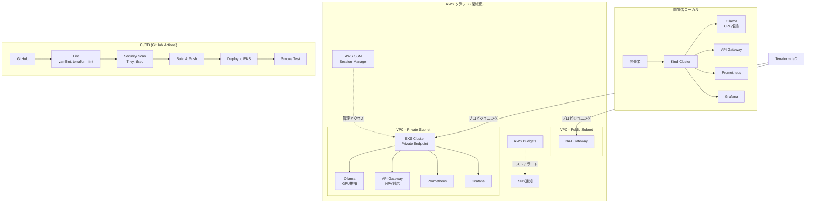

# Local LLM Platform

> **エンタープライズ向け 閉域網LLM推論基盤**
> 機密データを外部に出さずに生成AIを活用するための、セキュア・コスト最適化されたインフラ基盤

[](https://github.com/s-tutti/local-llm-platform/actions/workflows/ci.yml)
[](https://www.terraform.io/)
[](https://kubernetes.io/)
[](LICENSE)

## ビジネス課題

| 課題                               | 本プラットフォームの解決策                                         |
| ---------------------------------- | ------------------------------------------------------------------ |
| 機密データをSaaS LLMに送信できない | Ollama によるセルフホスト型LLMを閉域網内にデプロイ                 |
| クラウドコストが予測不能           | Spotインスタンス + スケジュールスケーリング + AWS Budgets アラート |
| セキュリティ監査への対応           | ゼロトラストネットワーク + VPC Flow Logs + KMS暗号化               |
| 環境間の構成ドリフト               | Kustomize overlay による宣言的な環境管理                           |
| 脆弱性の見逃し                     | CI/CDに Trivy + tfsec を統合した自動スキャン                       |

## アーキテクチャ



## プロジェクト構成

```
├── docs/adr/           # アーキテクチャ決定記録
├── infra/terraform/    # AWS インフラ (VPC, EKS, Security)
│   ├── modules/        # 再利用可能なモジュール
│   └── environments/   # 環境別変数 (dev, prod)
├── k8s/                # Kubernetes マニフェスト
│   ├── base/           # 共通ベース (Ollama, API Gateway, Monitoring)
│   └── overlays/       # 環境別オーバーレイ (local, production)
├── scripts/            # ローカル開発スクリプト
├── api-gateway/        # FastAPI ベース LLM プロキシ
└── .github/workflows/  # CI/CD パイプライン
```

## クイックスタート（ローカル開発）

### 前提条件

- Docker
- [Kind](https://kind.sigs.k8s.io/)
- kubectl
- kustomize

### 起動

```bash
# 1. Kind クラスタ作成
./scripts/setup-local-cluster.sh

# 2. プラットフォームデプロイ
./scripts/deploy-local.sh

# 3. モデルの取得と動作確認
kubectl -n llm-platform exec deploy/ollama -- ollama pull phi
curl http://localhost:8080/api/chat \
  -d '{"model":"phi","messages":[{"role":"user","content":"Hello!"}]}'
```

### アクセス先

| サービス    | URL                                 |
| ----------- | ----------------------------------- |
| API Gateway | http://localhost:8080               |
| Prometheus  | http://localhost:9090               |
| Grafana     | http://localhost:3000 (admin/admin) |

### 停止

```bash
./scripts/teardown-local.sh
```

## クラウドデプロイ（AWS）

```bash
# Terraform による AWS インフラ構築
cd infra/terraform/environments/dev
terraform init
terraform plan
terraform apply

# EKS へのマニフェスト適用
aws eks update-kubeconfig --name llm-platform-dev
kubectl apply -k k8s/overlays/production/
```

## セキュリティ設計

- **ネットワーク**: EKS Private Endpoint + Private Subnet + NAT Gateway
- **アクセス制御**: AWS SSM Session Manager（踏み台サーバー不要）
- **暗号化**: KMS によるEKS Secrets暗号化
- **監査**: VPC Flow Logs + CloudTrail
- **CI/CDスキャン**: Trivy（コンテナ脆弱性）+ tfsec（インフラ脆弱性）

## コスト最適化 (FinOps)

- GPU ノードは **Spot インスタンス** で 60-90% コスト削減
- 業務時間外の **スケジュールスケーリング** で GPU ノードを 0 台に
- **AWS Budgets** で 50%, 80%, 100% の閾値アラート
- **HPA** による API Gateway の自動スケーリング

## 技術スタック

| カテゴリ                     | 技術                    |
| ---------------------------- | ----------------------- |
| コンテナオーケストレーション | Kubernetes (Kind / EKS) |
| LLM ランタイム               | Ollama                  |
| IaC                          | Terraform               |
| CI/CD                        | GitHub Actions          |
| セキュリティスキャン         | Trivy, tfsec            |
| 監視                         | Prometheus, Grafana     |
| API                          | FastAPI (Python)        |

## ADR (Architecture Decision Records)

- [ADR-0001: ローカルLLMの採用](docs/adr/0001-local-llm-for-enterprise.md)
- [ADR-0002: ハイブリッドデプロイメント戦略](docs/adr/0002-hybrid-deployment.md)
- [ADR-0003: ゼロトラストネットワーク設計](docs/adr/0003-zero-trust-networking.md)
- [ADR-0004: FinOpsコスト最適化戦略](docs/adr/0004-finops-cost-optimization.md)
